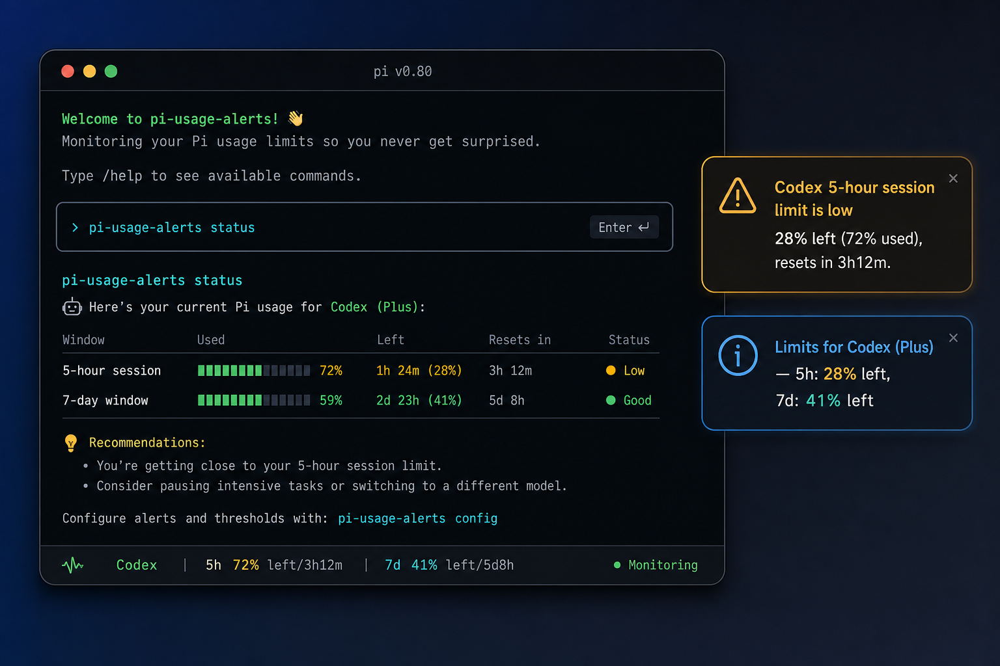

# pi-usage-alerts



Threshold notifications for Pi subscription session limits.

`pi-usage-alerts` watches the active Pi provider and warns when OpenAI Codex or Anthropic OAuth subscription windows are close to exhaustion. It is intentionally small: it does not rotate accounts, change models, or replace Pi's footer.

## Features

- Polls provider usage for the active model's OAuth subscription.
- Alerts at configurable **warning**, **critical**, and **exhausted** thresholds.
- Tracks both **5-hour** and **7-day** session windows.
- Notifies inside Pi and optionally via OS/terminal notifications.
- Detects rate-limit responses (HTTP 402, 403, 429) from the active provider.
- One alert per threshold and window until that window resets.

## Supported providers

| Provider family | Pi provider IDs |
| --- | --- |
| OpenAI Codex / ChatGPT subscription | `openai-codex`, `openai-codex-account-N` |
| Anthropic OAuth subscription | `anthropic`, `anthropic-account-N` |

GitHub Copilot and API-key billing providers are out of scope for v1 because Pi does not expose a usable session-limit API for them.

## Requirements

- [Pi](https://pi.dev) with `@earendil-works/pi-coding-agent`
- Node.js 20+
- OAuth login for a supported provider (`/login` in Pi)

## Install

From npm (when published):

```bash
pi install npm:pi-usage-alerts
```

From a git repository:

```bash
pi install git:github.com/ykertytsky/pi-usage-alerts
```

From a local checkout:

```bash
pi install /path/to/pi-usage-alerts
```

Try without installing (current session only):

```bash
pi -e /path/to/pi-usage-alerts/extensions/index.ts
```

Restart Pi or run `/reload` after installing.

## Usage

Authenticate with a supported subscription provider using Pi's normal login flow:

```text
/login
```

Then use Pi as usual. The extension checks usage at session start, after model changes, and after each turn. Alerts are deduplicated per provider, window, and threshold until that window resets. While a low-usage alert is active, a compact status segment (e.g. `usage 1% left · resets 57m`) stays visible in the status bar until the window recovers.

### Commands

| Command | Description |
| --- | --- |
| `/usage-alerts` | Show cached usage for the active provider |
| `/usage-alerts status` | Same as above |
| `/usage-alerts check` | Force a fresh poll and show details |
| `/usage-alerts refresh` | Alias for `check` |
| `/usage-alerts config` | Print the active configuration |

Example status output:

```text
Codex | 5h 72% left/3h12m | 7d 41% left/5d8h
```

## How alerts work

Usage is fetched from each provider's own OAuth usage endpoint using Pi's stored credentials (`AuthStorage`).

| Tier | Default trigger | Severity |
| --- | --- | --- |
| Warning | ≤ 30% remaining | `warning` |
| Critical | ≤ 10% remaining | `error` |
| Exhausted | 0% remaining | `error` |

Polling respects a minimum interval (5 minutes by default, 10 minutes minimum for Anthropic). A forced check via `/usage-alerts check` bypasses the interval.

When the active provider returns HTTP 402, 403, or 429, the extension emits a rate-limit alert (deduplicated for 60 seconds).

In Pi's TUI, alerts are sent through `ctx.ui.notify()` and the current active alert is mirrored into a compact status-bar segment (`usage <n>% left · resets <time>`, or `usage rate-limited`) via `ctx.ui.setStatus()`, so the key numbers stay visible during the session instead of only appearing as a transient notification.

On first Anthropic usage fetch, the extension warns that subscription auth may draw from Claude extra usage billed per token.

## Configuration

The extension creates `~/.pi/agent/usage-alerts.json` with mode `0600` the first time it needs config. Override the directory with `PI_CODING_AGENT_DIR`.

```json
{
  "enabled": true,
  "pollIntervalMs": 300000,
  "anthropicMinPollMs": 600000,
  "thresholds": {
    "warning": 30,
    "critical": 10
  },
  "windows": ["5h", "7d"],
  "osNotify": true,
  "osNotifyOnCriticalOnly": true
}
```

| Field | Default | Description |
| --- | --- | --- |
| `enabled` | `true` | Master switch for polling and alerts |
| `pollIntervalMs` | `300000` (5 min) | Minimum time between usage polls |
| `anthropicMinPollMs` | `600000` (10 min) | Floor for Anthropic polling (cannot go below 10 min) |
| `thresholds.warning` | `30` | Warn when remaining % is at or below this value |
| `thresholds.critical` | `10` | Critical alert threshold |
| `windows` | `["5h", "7d"]` | Which usage windows to monitor |
| `osNotify` | `true` | Send OS/terminal notifications |
| `osNotifyOnCriticalOnly` | `true` | Only OS-notify on critical and exhausted tiers |

## OS notifications

When enabled, critical and exhausted alerts also trigger a best-effort OS notification:

- **Windows Terminal** — native toast via PowerShell
- **Kitty** — OSC 99 desktop notification
- **Other terminals** — OSC 777 notification (Ghostty, iTerm2, WezTerm, etc.)

In-Pi notifications are always authoritative; OS delivery is best-effort.

## Privacy

The extension reads Pi's credential store through `AuthStorage`, the same resolver Pi uses for provider requests. It sends OAuth access tokens only to the provider's own usage endpoints:

- `https://chatgpt.com/backend-api/wham/usage`
- `https://api.anthropic.com/api/oauth/usage`

The config file contains only alert settings. No credentials or usage snapshots are persisted.

## Development

```bash
git clone https://github.com/ykertytsky/pi-usage-alerts.git
cd pi-usage-alerts
npm install
npm run check
pi -e ./extensions/index.ts
```

### Project layout

```text
extensions/index.ts   Pi extension entry (events, commands)
src/alerts.ts         Threshold evaluation and alert state
src/config.ts         Config load/normalize (~/.pi/agent/usage-alerts.json)
src/usage.ts          Provider usage fetch and parsing
src/notify-os.ts      Terminal/OS notification adapters
src/types.ts          Shared types
```

## License

[MIT](LICENSE)

## Publishing

This package is distributed on [npm](https://www.npmjs.com/package/pi-usage-alerts) and indexed by the [Pi package gallery](https://pi.dev/packages) via the `pi-package` keyword.

```bash
npm login
npm publish
```

Users install with:

```bash
pi install npm:pi-usage-alerts
```
